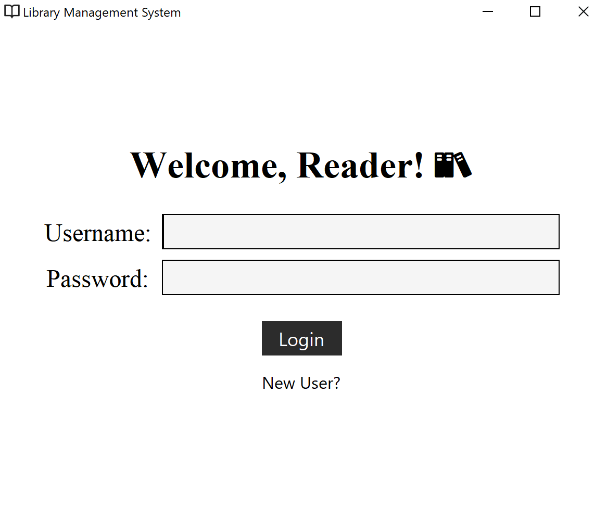

# Library Management System 

A simple application for an online library system using Java Swing and PostgresSQL 📚.

## Screenshots:
### Login | Register Page:
 

### User Dashboard:
 

### Admin Dashboard:
 
